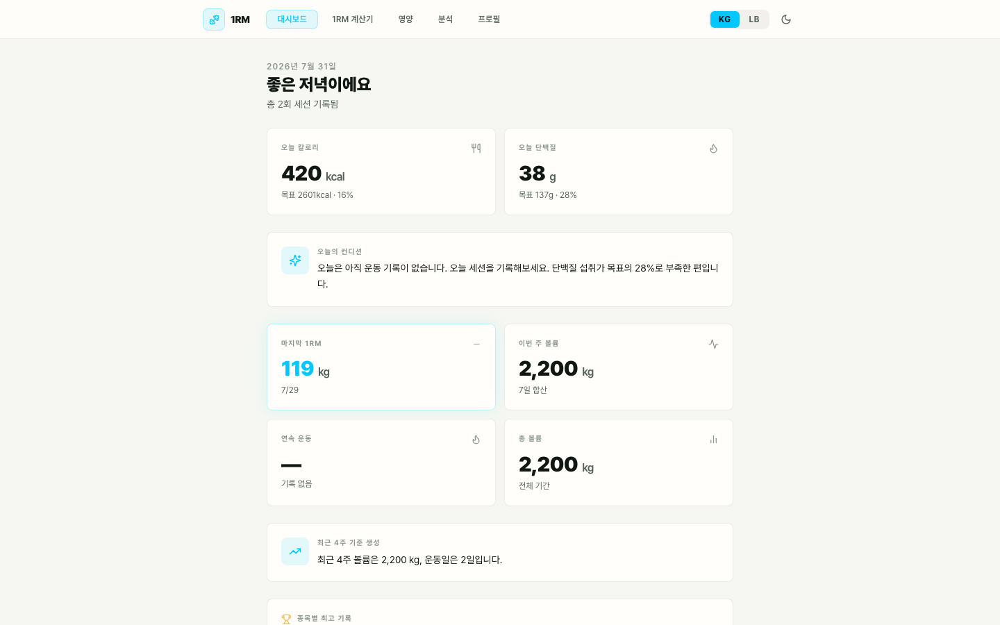
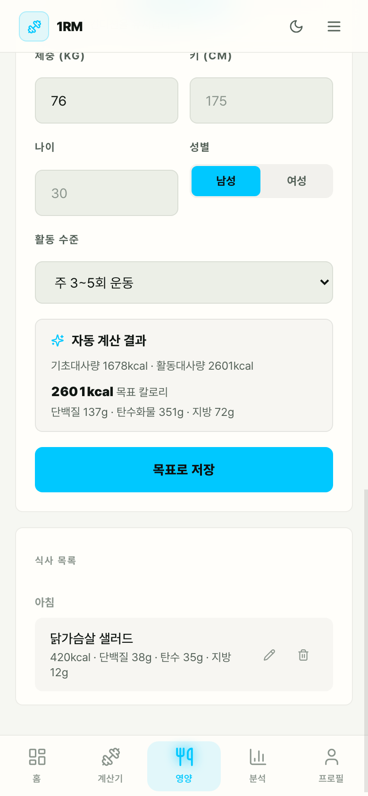
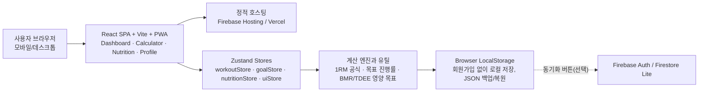

# 1RM 계산기

웨이트 트레이닝 기록을 바탕으로 예상 1RM, 훈련 볼륨, 목표 진행률, PR 후보를 관리하는 React 기반 PWA입니다. 로그인 없이 로컬 기록 앱으로 사용할 수 있고, Firebase 환경 변수를 연결하면 Google 로그인과 Firestore 동기화 준비 상태로 확장됩니다.

<p align="center">
  <strong>웹 주소:</strong>
  <a href="https://rm-calculator-3cf1d.web.app">https://rm-calculator-3cf1d.web.app</a>
</p>

<p align="center">
  <a href="https://rm-calculator-3cf1d.web.app"></a>
  <a href="https://1rm-calculator.vercel.app"></a>
  
  
</p>

## 현재 상태

이 저장소는 단순 계산기에서 서비스형 운동 기록 앱으로 확장 중입니다.

- 로컬 기록, 목표, 분석, 백업/복원은 동작합니다.
- 운동 기록과 나란히 식사(칼로리/단백질/탄수화물/지방)를 기록하고, 체중·활동 수준·목표 모드로 칼로리/단백질 목표를 자동 계산하는 영양 기록 기능이 추가됐습니다.
- 노치/홈 인디케이터 대응(safe-area-inset), 오버스크롤 방지, 공용 디자인 프리미티브(`Button`/`Card`/`Field`) 도입 등 PWA·UI/UX를 다듬었습니다.
- Firebase Auth/Firestore 동기화 구조와 보안 규칙은 준비되어 있습니다.
- 실제 Firebase 프로젝트 환경 변수 연결, Google 로그인 실동기화 QA, Emulator rules 테스트는 다음 단계입니다.
- 프로필에서 데이터 처리 안내, 출시 준비도, 진단 정보를 확인할 수 있습니다.

## 주요 화면

### 대시보드

최근 1RM, 주간 볼륨, 총 볼륨, 오늘의 칼로리/단백질 게이지, 운동+영양을 합친 오늘의 컨디션 요약, 목표 진행률을 확인합니다. 첫 방문자는 `1RM 계산 -> 세션 기록 -> 목표 설정` 순서로 시작할 수 있습니다. 모바일 PWA와 데스크톱 웹 양쪽에서 같은 정보를 반응형 레이아웃으로 보여줍니다.




### 1RM 계산기

운동 종목, 무게, 반복 횟수, 세트 수, RPE, 날짜, 메모를 입력합니다. 앱이 종목별 추천 공식을 자동 적용하고, 추정 신뢰도와 예상 범위를 함께 표시합니다.


### 영양 기록

끼니별로 칼로리/단백질/탄수화물/지방을 기록하고 즐겨찾기로 자주 먹는 음식을 재사용합니다. 체중, 활동 수준, 목표 모드(증량/유지/감량)를 입력하면 BMR/TDEE 기반으로 칼로리·단백질 목표를 자동 계산하고, 오늘 섭취량 대비 달성률을 보여줍니다.



### 분석

기간별 세션 수, 총 볼륨, 평균 1RM, PR 후보, RPE 기반 강도 해석, 종목별 흐름, 주간 영양 섭취 추이를 확인합니다. 기록이 없을 때는 계산기로 이동하는 CTA를 제공합니다.


## 핵심 기능

| 기능 | 설명 |
|---|---|
| 1RM 자동 계산 | 종목별 추천 공식으로 예상 1RM을 계산하고 공식별 비교를 제공합니다. |
| 추정 신뢰도 | 반복 횟수 기반으로 1RM 추정 신뢰도와 예상 범위를 표시합니다. |
| 세션 기록 | 무게, 반복 횟수, 세트 수, RPE, 날짜, 메모를 저장합니다. |
| 기록 관리 | 저장된 기록을 수정/삭제하고 삭제 tombstone으로 동기화 충돌을 방지합니다. |
| 목표 관리 | 목표 1RM과 목표일을 저장하고 주간 필요 증가량을 계산합니다. |
| 분석 해석 | PR 후보, 평균 RPE, 최근 볼륨과 종목별 1RM 흐름을 문장으로 요약합니다. |
| 영양 기록 | 끼니별 칼로리/단백질/탄수화물/지방을 기록하고 즐겨찾기로 재사용합니다. |
| 칼로리/단백질 목표 계산 | 체중, 활동 수준, 목표 모드로 BMR/TDEE 기반 목표를 자동 계산하고 달성률을 표시합니다. |
| 백업/복원 | JSON 내보내기/가져오기로 로컬 데이터(운동 기록과 영양 기록 모두)를 보존합니다. |
| 계정 동기화 준비 | Firebase Auth/Firestore 기반 로그인 동기화 구조를 제공합니다. |
| PWA 상태 | 오프라인 상태와 새 버전 업데이트 알림을 표시합니다. |
| 운영 화면 | 데이터 처리 안내, 출시 준비도, 진단 정보를 앱 안에서 확인합니다. |

## 화면 구성

| 화면 | 용도 |
|---|---|
| 대시보드 | 전체 운동 상태, 최근 기록, 4주 볼륨 요약, 오늘의 영양 게이지, 목표 진행률을 봅니다. |
| 1RM 계산기 | 1RM 계산과 세션 기록 생성/수정/삭제를 수행합니다. |
| 영양 | 끼니 기록, 즐겨찾기, 칼로리/단백질 목표 자동 계산과 달성률을 관리합니다. |
| 분석 | 기간별 통계, PR 후보, RPE 해석, 주간 영양 추이 차트를 확인합니다. |
| 프로필 | 단위, 테마, 백업/복원, 계정 동기화 상태를 관리합니다. |
| 데이터 처리 안내 | 저장 데이터, 미저장 데이터, 삭제 요청 절차를 안내합니다. |
| 출시 준비도 | Firebase env, 보안 규칙, CI, 브라우저 QA, 성능 예산, 운영 문의 채널 준비 상태를 확인합니다. |
| 진단 정보 | 최근 런타임 오류를 로컬에 보관하고 지원 패키지로 내려받거나 문의 메일에 첨부할 수 있습니다. |

## 데이터 저장과 동기화

기본 상태에서는 브라우저 로컬 스토리지에 저장합니다.

- 운동 기록
- 목표 1RM과 목표 날짜
- 삭제 tombstone
- 목표 삭제 tombstone
- 영양 기록(끼니별 칼로리/단백질/탄수화물/지방)
- 칼로리/단백질 목표와 즐겨찾기 음식
- 영양 기록 삭제 tombstone
- kg/lb 단위 설정
- 라이트/다크 모드 설정
- 마지막 동기화 상태와 진단 정보

진단 지원 패키지는 앱 버전, 브라우저 정보, 현재 경로, 동기화 설정 상태, 최근 오류만 포함합니다. 운동 기록, 목표, Firebase 비밀값은 포함하지 않습니다.

Firebase 환경 변수가 없거나 값 형식이 맞지 않으면 프로필에는 `로컬 모드`가 표시됩니다. 필수 Firebase 값이 있고 형식 검증을 통과하면 Google 로그인과 Firestore 동기화를 사용할 수 있는 준비 상태로 전환됩니다.

필수 Firebase 환경 변수:

```text
VITE_FIREBASE_API_KEY=
VITE_FIREBASE_AUTH_DOMAIN=
VITE_FIREBASE_PROJECT_ID=
VITE_FIREBASE_APP_ID=
```

공개 운영 필수 환경 변수:

```text
VITE_SUPPORT_EMAIL=
```

값 형식 기준:

- `VITE_FIREBASE_API_KEY`: Firebase Web API key, 보통 `AIza`로 시작
- `VITE_FIREBASE_AUTH_DOMAIN`: 프로토콜 없는 도메인, 예: `project-id.firebaseapp.com`
- `VITE_FIREBASE_PROJECT_ID`: Firebase 프로젝트 ID
- `VITE_FIREBASE_APP_ID`: Firebase Web app ID, 예: `1:123456789:web:abcdef`

선택 환경 변수:

```text
VITE_FIREBASE_STORAGE_BUCKET=
VITE_FIREBASE_MESSAGING_SENDER_ID=
```

`VITE_SUPPORT_EMAIL`에 올바른 이메일 주소를 설정하면 데이터 처리 안내 화면에서 계정 데이터 삭제 요청 메일 링크가 활성화됩니다.

환경 변수 검증:

```bash
npm run verify:env
```

배포 환경에서는 필수 Firebase 값과 운영 문의 이메일 누락까지 실패시키도록 다음 명령을 사용합니다.

```bash
REQUIRE_FIREBASE_ENV=1 npm run verify:env
```

## 계산 기준

### 1RM 계산

반복 횟수는 `1~15회`를 권장 범위로 사용합니다. 반복 수가 높아질수록 1RM 추정 오차가 커질 수 있어 결과 카드에 신뢰도와 범위를 함께 표시합니다.

| 종목 | 자동 적용 공식 | 적용 이유 |
|---|---|---|
| 벤치프레스 | Mayhew | 벤치프레스 연구 기반 추정에 적합 |
| 스쿼트 | Epley | 대형 복합 리프트에 안정적 |
| 데드리프트 | Brzycki | 저반복 고중량 추정에 적합 |
| 오버헤드프레스 | O'Conner | 상체 프레스에 보수적 |
| 바벨로우 | Lombardi | 보조 리프트 추정에 보수적 |

## 로컬 실행

### 요구 사항

- Node.js `20` 이상, `25` 미만
- npm

### 설치

```bash
npm install
```

### 개발 서버

```bash
npm run dev
```

기본 접속 주소:

```text
http://localhost:5173
```

### 테스트

```bash
npm run test
```

현재 테스트는 계산 공식, 백업/복원, 목표 계획, 동기화 병합, Firestore 접근/쓰기 스키마 모델, firestore.rules 정적 audit, PWA/개인정보/진단/온보딩 문구를 검증합니다.

### 릴리즈 프리플라이트

```bash
npm run verify:release
```

이 명령은 공개 도메인, `robots.txt`, `sitemap.xml`, `health.json`, Firebase Hosting rewrite, Vercel rewrite, `.env.example`, Firestore rules 연결을 점검합니다.

### 환경 변수 검증

```bash
npm run verify:env
```

`.env`, `.env.local`, `.env.production`, `.env.production.local`과 현재 프로세스 환경 변수를 읽어 Firebase 값 형식과 프로젝트 ID 일관성을 확인합니다. 실제 배포 CI에서는 `REQUIRE_FIREBASE_ENV=1 npm run verify:env`로 필수값 누락까지 실패 처리합니다.

### 성능 예산

```bash
npm run verify:performance
```

프로덕션 빌드 후 `dist/assets` 기준으로 전체 assets, 최대 JS 청크, CSS 크기를 검사합니다. `npm run check`에도 포함되어 있습니다.

### 프로덕션 빌드

```bash
npm run build
```

### 전체 확인

```bash
npm run check
```

GitHub Actions CI도 같은 품질 게이트를 실행합니다. `main` 브랜치 push와 pull request에서 `npm ci` 후 `npm run check`를 수행하고, 별도 잡에서 `npm run qa:browser:server`로 주요 브라우저 플로우를 검증합니다.

### 브라우저 QA

```bash
npm run qa:browser
```

이 명령은 실행 중인 `http://127.0.0.1:5173` 앱을 headless Chrome으로 검증합니다. 첫 방문 온보딩, 계산, 수정, 목표, 분석, 프로필, 데이터 처리 안내, 출시 준비도, 진단 정보, 삭제 플로우를 확인합니다.

일부 제한된 실행 환경에서 npm 하위 프로세스가 Chrome DevTools 포트를 열지 못하면 같은 스크립트를 직접 실행합니다.

```bash
node --experimental-websocket scripts/verify-browser.mjs
```

```bash
npm run dev -- --host 127.0.0.1 --port 5173
npm run qa:browser
```

로컬 환경에서 서버 자동 기동까지 함께 실행하려면 다음 명령을 사용할 수 있습니다.

```bash
npm run qa:browser:server
```

테스트, 프로덕션 빌드, 브라우저 QA는 아래 순서로 실행합니다.

```bash
npm run check
npm run qa:browser
```

## 출시 전 확인

자세한 기준은 [릴리즈 체크리스트](docs/release-checklist.md)를 따릅니다. 앱 안에서는 프로필의 `출시 준비도` 화면에서 Firebase 환경 변수별 출처와 설정 상태를 확인할 수 있습니다.

필수 흐름:

1. `npm run test`
2. `npm run build`
3. `npm run qa:browser`
4. Firebase env 연결
5. Google 로그인과 Firestore 실동기화 QA
6. Firestore rules 배포 및 Emulator 테스트

## 기술 스택

| 영역 | 사용 기술 |
|---|---|
| 프론트엔드 | React 18 |
| 빌드 | Vite 6 |
| 스타일링 | Tailwind CSS |
| 애니메이션 | Framer Motion |
| 차트 | Recharts |
| 상태 관리 | Zustand |
| 날짜 처리 | date-fns |
| 계정/동기화 | Firebase Auth, Firestore Lite |
| PWA | vite-plugin-pwa |
| 배포 | Firebase Hosting, Vercel |

계정 동기화는 사용자가 직접 동기화 버튼을 누르는 수동 병합 방식이므로, 초기 로딩과 PWA precache 크기를 줄이기 위해 실시간 구독용 Firestore SDK 대신 Firestore Lite를 사용합니다.

운영 모니터링은 `/health.json`을 사용할 수 있습니다. 이 파일은 canonical URL, 버전, 주요 품질 게이트를 담고 Firebase Hosting에서 `Cache-Control: no-store`로 제공됩니다.

## 시스템 아키텍처



자세한 데이터 흐름(입력→저장→동기화, 삭제)과 모듈 의존 관계는 [시스템 아키텍처와 데이터 흐름](docs/architecture.md) 문서를 참고하세요.

## 프로젝트 구조

```text
src/
  app/                  앱 레이아웃
  components/common/    네비게이션, PWA 상태, 오류 경계, 진단 수집, Button/Card/Field 프리미티브
  constants/            운동 목록과 차트 색상
  features/
    1rm/                1RM 계산기
    dashboard/          대시보드
    nutrition/          영양 기록(끼니 입력, 목표 자동 계산, 즐겨찾기)
    analytics/          분석 화면
    profile/            설정과 데이터 관리
    privacy/            데이터 처리 안내
    readiness/          출시 준비도
    diagnostics/        런타임 진단 정보
  hooks/                공통 훅
  lib/                  계산, 백업, 동기화, 운영 유틸
  store/                Zustand 스토어(workoutStore, goalStore, nutritionStore 등)

docs/                   서비스화 문서와 릴리즈 체크리스트
tests/                  Node 기반 로직 테스트
```

## 관련 문서

- [시스템 아키텍처와 데이터 흐름](docs/architecture.md)
- [서비스 로드맵](docs/service-roadmap.md)
- [동기화 아키텍처](docs/sync-architecture.md)
- [릴리즈 체크리스트](docs/release-checklist.md)
- [계정 데이터 삭제 운영 절차](docs/account-deletion-runbook.md)

## 라이선스

MIT License
