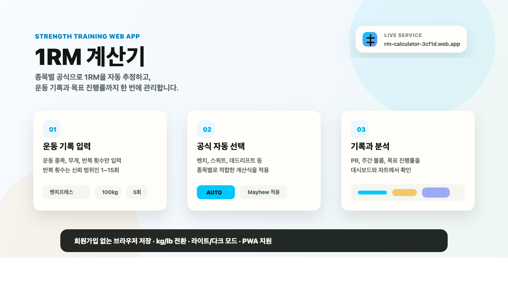
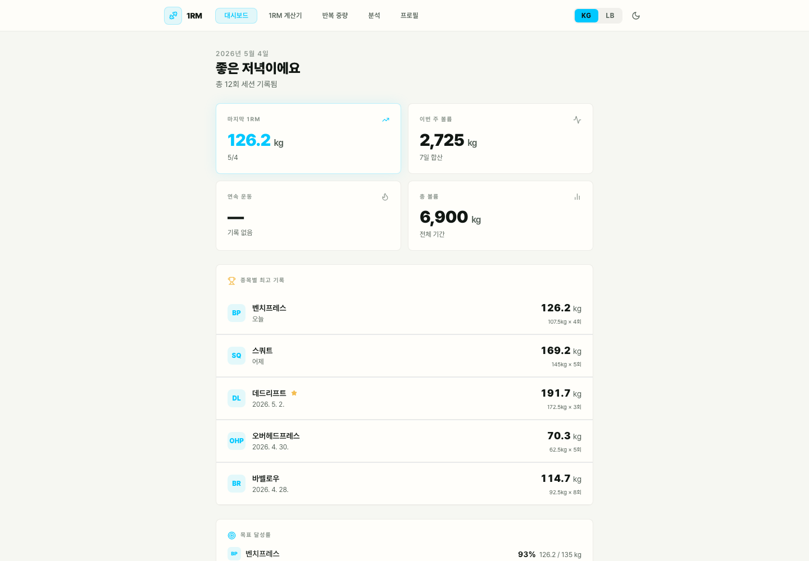
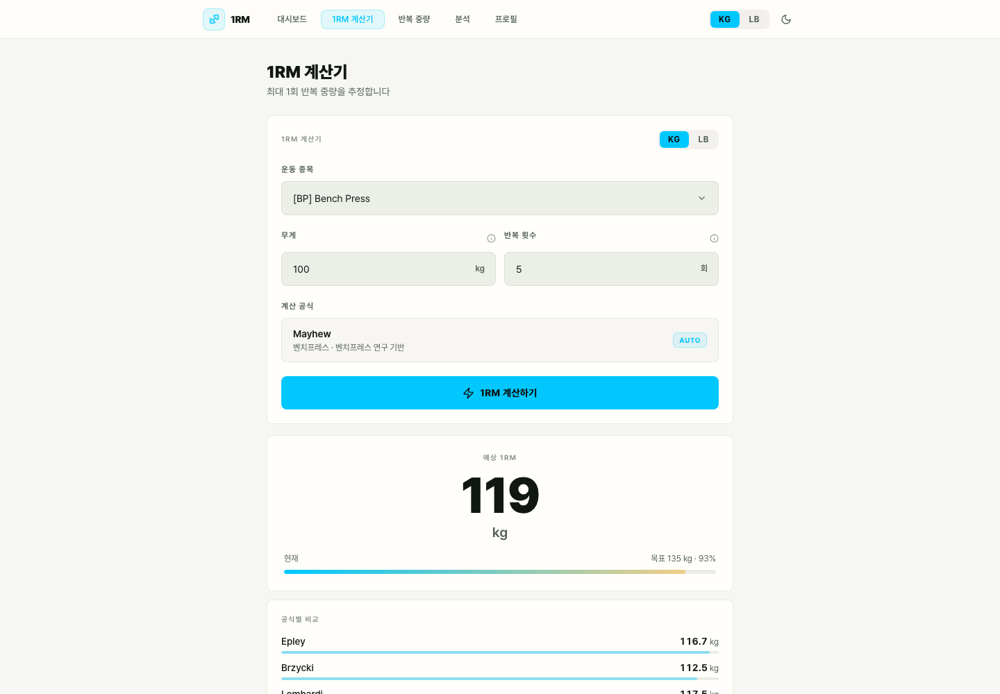
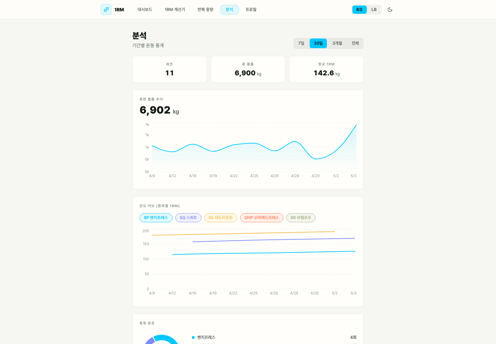

# 1RM 계산기

<p align="center">
  
</p>

웨이트 트레이닝 기록을 바탕으로 예상 1RM을 계산하고, PR·목표·볼륨 추이를 함께 관리하는 React 기반 웹앱입니다. 운동 종목을 선택하면 앱이 적합한 계산 공식을 자동으로 적용하므로, 사용자는 무게와 반복 횟수만 입력하면 됩니다.

<p align="center">
  <a href="https://rm-calculator-3cf1d.web.app"><strong>서비스 바로가기</strong></a>
  ·
  <a href="https://1rm-calculator.vercel.app"><strong>Vercel 미러</strong></a>
  ·
  <a href="https://github.com/amuldi/1rm_calculator"><strong>GitHub 저장소</strong></a>
</p>

<p align="center">
  <a href="https://rm-calculator-3cf1d.web.app"></a>
  <a href="https://1rm-calculator.vercel.app"></a>
  
  
</p>

## 실행 화면

아래 이미지는 README 설명을 위해 샘플 운동 기록을 넣고 촬영한 실제 웹 실행 화면입니다.

### 대시보드

최근 1RM, 주간 볼륨, 종목별 PR, 목표 진행률을 한 화면에서 확인합니다.



### 1RM 계산기

운동 종목, 무게, 반복 횟수를 입력하면 종목별 추천 공식으로 1RM을 계산하고 공식별 비교 결과를 함께 보여줍니다.



### 분석

기간별 운동량, 종목별 1RM 변화, 종목 분포를 차트로 확인합니다.



## 핵심 기능

| 기능 | 설명 |
|---|---|
| 1RM 자동 계산 | 운동 종목, 무게, 반복 횟수만 입력하면 예상 1RM을 계산합니다. |
| 종목별 공식 자동 선택 | 사용자가 공식을 고르지 않아도 종목에 맞는 계산식을 자동 적용합니다. |
| 반복 중량 계산 | 1RM과 목표 반복 횟수를 기준으로 실전 훈련 중량을 계산합니다. |
| 기록 저장 | 계산 결과를 브라우저 로컬 스토리지에 저장해 PR과 훈련 흐름을 추적합니다. |
| 대시보드 | 최근 기록, 주간 볼륨, 총 볼륨, 연속 운동일, 목표 진행률을 보여줍니다. |
| 분석 차트 | 볼륨 추이, 종목별 강도 변화, 운동 분포를 시각화합니다. |
| 사용자 설정 | kg/lb 단위 전환, 라이트/다크 모드, 데이터 백업/복원을 지원합니다. |

## 화면 구성

| 화면 | 용도 |
|---|---|
| 대시보드 | 전체 운동 상태와 PR을 빠르게 확인합니다. |
| 1RM 계산기 | 최대 15회 반복 기록으로 예상 1RM을 계산합니다. |
| 반복 중량 | 목표 반복 횟수에 맞는 훈련 중량을 계산합니다. |
| 분석 | 기간별 볼륨과 종목별 1RM 변화를 확인합니다. |
| 프로필 | 단위, 테마, 데이터 백업/복원을 관리합니다. |

## 계산 기준

### 1RM 계산

반복 횟수는 `1~15회`까지만 입력할 수 있습니다. 반복 수가 너무 높아지면 1RM 추정 오차가 커질 수 있어, 비교적 신뢰하기 쉬운 범위로 제한했습니다.

공식은 사용자가 직접 고르지 않습니다. 운동 종목을 선택하면 앱이 아래 기준으로 자동 적용합니다.

| 종목 | 자동 적용 공식 | 적용 이유 |
|---|---|---|
| 벤치프레스 | Mayhew | 벤치프레스 연구 기반 추정에 적합 |
| 스쿼트 | Epley | 대형 복합 리프트에 안정적 |
| 데드리프트 | Brzycki | 저반복 고중량 추정에 적합 |
| 오버헤드프레스 | O'Conner | 상체 프레스에 보수적 |
| 바벨로우 | Lombardi | 보조 리프트 추정에 보수적 |

계산 결과에서는 적용된 공식뿐 아니라 다른 공식의 결과도 함께 보여주며, 실제 적용 공식에는 `적용` 표시가 붙습니다.

### 반복 중량 계산

반복 중량 화면은 `1RM -> 목표 반복 횟수에서 사용할 훈련 중량`을 계산합니다.

- 지원 반복 횟수: `1~15회`
- 계산 방식: 종목별 `%1RM` 테이블
- kg 반올림: `2.5kg` 단위
- lb 반올림: `5lb` 단위

예시:

```text
벤치프레스 1RM: 130kg
목표 반복 횟수: 8회
예상 훈련 중량: 약 105kg
```

## 데이터 저장 방식

이 앱은 별도 서버나 회원가입 없이 브라우저 로컬 스토리지에 데이터를 저장합니다.

- 운동 기록
- 목표 1RM
- kg/lb 단위 설정
- 라이트/다크 모드 설정

프로필 화면에서 JSON 파일로 데이터를 백업하거나 복원할 수 있습니다.

## 로컬 실행

### 요구 사항

- Node.js `20` 이상, `25` 미만
- npm

### 설치

```bash
npm install
```

### 개발 서버 실행

```bash
npm run dev
```

기본 접속 주소는 다음과 같습니다.

```text
http://localhost:5173
```

### 프로덕션 빌드

```bash
npm run build
```

### 빌드 결과 미리보기

```bash
npm run preview
```

## 기술 스택

| 영역 | 사용 기술 |
|---|---|
| 프론트엔드 | React 18 |
| 빌드 | Vite 6 |
| 스타일링 | Tailwind CSS |
| 애니메이션 | Framer Motion |
| 차트 | Recharts |
| 상태 관리 | Zustand |
| 날짜 처리 | date-fns |
| PWA | vite-plugin-pwa |
| 배포 | Firebase Hosting, Vercel |

## 프로젝트 구조

```text
src/
  app/                  앱 레이아웃
  components/common/    공통 네비게이션과 스플래시
  constants/            운동 목록과 차트 색상
  features/
    1rm/                1RM 계산기
    translator/         반복 중량 계산
    dashboard/          대시보드
    analytics/          분석 차트
    profile/            설정과 데이터 관리
  hooks/                공통 훅
  lib/                  단위 변환과 기록 유틸
  store/                Zustand 스토어

docs/images/            README 이미지와 실행 화면 캡처
```

## 적합한 사용자

- 1RM을 빠르게 계산하고 싶은 사람
- 종목별 PR을 간단히 관리하고 싶은 사람
- 목표 반복 수에 맞는 훈련 중량이 필요한 사람
- 회원가입 없이 가볍게 운동 기록을 남기고 싶은 사람
- kg/lb 단위를 오가며 기록을 관리하는 사람

## 라이선스

MIT License
