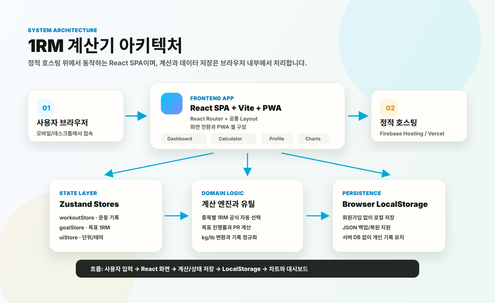
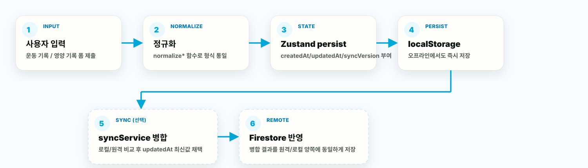
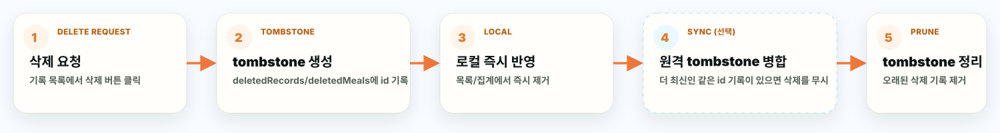

# System Architecture & Data Flow

이 문서는 1RM 계산기의 시스템 구성과 데이터가 사용자의 입력부터 저장·동기화·삭제까지 어떻게 흐르는지 다룹니다. 계정 동기화 자체의 설계 근거와 충돌 정책은 [동기화 아키텍처](sync-architecture.md)를 따로 참고하세요.

## 시스템 구성도



- **사용자 브라우저**: 모바일/데스크톱에서 접속하는 단일 진입점입니다.
- **React SPA + Vite + PWA**: 화면 전환, 상태 관리, PWA 셸을 담당합니다. 서버 렌더링이나 별도 백엔드 API가 없습니다.
- **Zustand Stores**: `workoutStore`, `goalStore`, `nutritionStore`, `uiStore`가 각각 운동 기록, 1RM 목표, 영양 기록/목표, 화면 설정을 보관하고 `persist` 미들웨어로 로컬 스토리지에 자동 저장합니다.
- **계산 엔진과 유틸**(`src/lib`, `features/*/utils`): 1RM 공식, 목표 진행률, BMR/TDEE 기반 영양 목표, kg/lb 변환/정규화 등 순수 함수 계층입니다. React 컴포넌트와 완전히 분리되어 있어 Node 테스트로 직접 검증합니다.
- **Browser LocalStorage**: 기본 저장소입니다. 회원가입 없이도 앱 전체 기능이 동작하며, JSON 백업/복원으로 데이터를 소유할 수 있습니다.
- **Firebase Auth/Firestore Lite**(선택): 환경 변수가 설정된 경우에만 활성화됩니다. 로그인 후 사용자가 프로필에서 동기화 버튼을 눌러야 로컬/원격 데이터를 병합합니다.
- **정적 호스팅**(Firebase Hosting/Vercel): 빌드 산출물을 서빙하는 배포 대상입니다. 앱 로직과 데이터는 브라우저 안에서만 처리됩니다.

## 데이터 흐름 다이어그램

### 1. 입력 → 로컬 저장 → (선택) 동기화 흐름



1. **사용자 입력**: 계산기의 세션 폼이나 영양 기록의 식사 폼을 제출합니다.
2. **정규화**: `normalizeWorkoutRecord`(`src/lib/utils.js`) 또는 `normalizeMealRecord`(`src/features/nutrition/utils/nutritionMath.js`)가 값 범위를 clamp하고 누락된 필드에 기본값을 채웁니다.
3. **Zustand persist**: 각 store의 액션(`addRecord`, `addMeal` 등)이 `createdAt`/`updatedAt`/`syncVersion`을 부여하고 상태를 갱신합니다.
4. **localStorage**: `persist` 미들웨어가 상태 변경을 감지해 즉시 직렬화합니다. 네트워크 없이도 완전히 동작합니다.
5. **syncService 병합**(Firebase 연결 + 로그인 상태에서 사용자가 동기화를 실행한 경우): 로컬과 원격 컬렉션을 모두 읽어 같은 `id`는 `updatedAt`이 최신인 값을 채택합니다(`src/lib/syncModel.js`의 `pickLatestEntity`/`mergeEntityList`).
6. **Firestore 반영**: 병합 결과를 `writeBatch`로 원격에 쓰고, 동일한 결과를 로컬 store에도 다시 반영해 두 저장소를 일치시킵니다.

5~6단계는 Firebase 환경 변수가 없으면 실행되지 않고, 1~4단계만으로 앱의 모든 핵심 기능(계산, 기록, 목표, 영양 추적, 백업)이 동작합니다.

### 2. 삭제 흐름



1. **삭제 요청**: 기록/식사 목록에서 삭제 버튼을 누릅니다.
2. **tombstone 생성**: 실제로 항목을 지우는 대신 `deletedRecords`/`deletedMeals`/`deletedGoals`에 `{ id, deletedAt, updatedAt, syncVersion }` 형태의 tombstone을 추가합니다(`src/lib/syncModel.js`의 `normalizeDeletedEntity`).
3. **로컬 즉시 반영**: 해당 항목을 store의 배열/맵에서 제거해 화면에서 즉시 사라지게 합니다.
4. **원격 tombstone 병합**(동기화 시): 원격에도 같은 id의 tombstone이 있으면 최신 것을 채택하고(`mergeDeletedEntities`), 삭제보다 더 최신인 같은 id 레코드가 남아 있으면 삭제를 무시하고 레코드를 보존합니다(`applyDeletedEntities`).
5. **오래된 tombstone 정리**: 대응하는 레코드가 이미 존재하지 않거나 tombstone이 레코드보다 최신인 경우, 더 이상 필요 없는 tombstone을 정리합니다(`pruneObsoleteDeletedEntities`).

이 tombstone 정책 덕분에 "기기 A에서 삭제 → 기기 B에서 아직 동기화 전 상태로 수정" 같은 충돌에서도 어느 한쪽 데이터가 이유 없이 되살아나지 않습니다.

## 모듈 간 의존 관계

앱은 아래 방향으로만 의존합니다(역방향 의존 없음).

```text
features/*  →  store/*  →  lib/* (계산 · 동기화 · 운영 유틸)
```

| 계층 | 예시 | 책임 |
|---|---|---|
| `features/*` | `features/1rm`, `features/nutrition` | 화면 컴포넌트, 폼 상태를 다루는 훅(`use1RM`, `useNutrition`) |
| `store/*` | `workoutStore`, `goalStore`, `nutritionStore` | 영속 상태, tombstone 관리, store 전용 액션 |
| `lib/*` | `utils.js`, `syncModel.js`, `backup.js` | 순수 계산/정규화/병합 함수. React나 Zustand에 의존하지 않음 |

영양 도메인은 운동 도메인과 대칭적으로 설계됐습니다.

| 운동 도메인 | 영양 도메인 |
|---|---|
| `workoutStore` (`history`, `deletedRecords`) | `nutritionStore` (`meals`, `deletedMeals`) |
| `goalStore` (종목별 목표 1RM) | `nutritionStore.goal` (칼로리/단백질 목표) |
| `normalizeWorkoutRecord` | `normalizeMealRecord` |
| `features/1rm/utils/formulas.js` | `features/nutrition/utils/nutritionMath.js` |
| `GoalSetter.jsx`(1RM) | `GoalSetter.jsx`(영양, BMR/TDEE 자동 계산 포함) |

이 대칭 구조 덕분에 영양 데이터도 `createdAt`/`updatedAt`/`syncVersion`과 tombstone을 그대로 갖추고 있어, 위 데이터 흐름과 Firebase 동기화 구조에 추가 설계 없이 편입됩니다. 다만 현재 `syncService.js`는 운동 기록/목표만 Firestore에 실제로 읽고 쓰며, 영양 데이터의 Firestore 동기화는 아직 연결되지 않았습니다(로컬 저장과 JSON 백업/복원은 완전히 동작합니다). 이는 [서비스 로드맵](service-roadmap.md)의 다음 단계 후보로 남아 있습니다.

## 오프라인/PWA 동작

- **캐시 전략**: `vite-plugin-pwa`를 `generateSW` 모드로 사용합니다. 빌드 시 Workbox가 `dist/assets`의 모든 정적 자산(JS/CSS/아이콘/manifest)을 precache 목록에 담고, SPA 내비게이션은 캐시된 `index.html`로 폴백합니다. 별도의 API 캐싱 규칙은 없습니다 — 앱에 서버 API 자체가 없기 때문입니다.
- **오프라인 읽기/쓰기**: 모든 화면과 계산 로직이 로컬 상태(Zustand + localStorage)만으로 동작하므로, 오프라인 상태에서도 운동 기록/영양 기록 생성·수정·삭제·목표 계산이 그대로 동작합니다. `PWAStatus` 컴포넌트가 `navigator.onLine`과 `online`/`offline` 이벤트를 감지해 오프라인 배너를 보여줍니다.
- **동기화는 자동이 아닌 수동**: 온라인으로 복귀해도 앱이 자동으로 재동기화를 시도하지 않습니다. Firebase가 연결되고 로그인된 사용자가 프로필의 `동기화` 버튼을 직접 눌러야 로컬/원격 병합이 실행됩니다(`src/features/profile/index.jsx`의 `handleSync`). 이는 사용자가 언제 네트워크 요청이 발생하는지 예측 가능하게 하려는 의도적인 설계입니다.
- **새 버전 업데이트**: `registerType: "autoUpdate"`로 서비스워커는 백그라운드에서 새 빌드를 감지합니다. `PWAStatus`가 업데이트 가능 상태를 감지하면 배너로 알리고, 사용자가 버튼을 눌러야 `updateServiceWorker(true)`로 새 버전을 적용합니다(즉시 자동 리로드하지 않음).

## 관련 문서

- [동기화 아키텍처](sync-architecture.md) — 계정 동기화 스택 선택 이유, Firestore 데이터 모델, 충돌 정책 상세
- [서비스 로드맵](service-roadmap.md) — Phase 단위 진행 상황과 다음 우선순위
